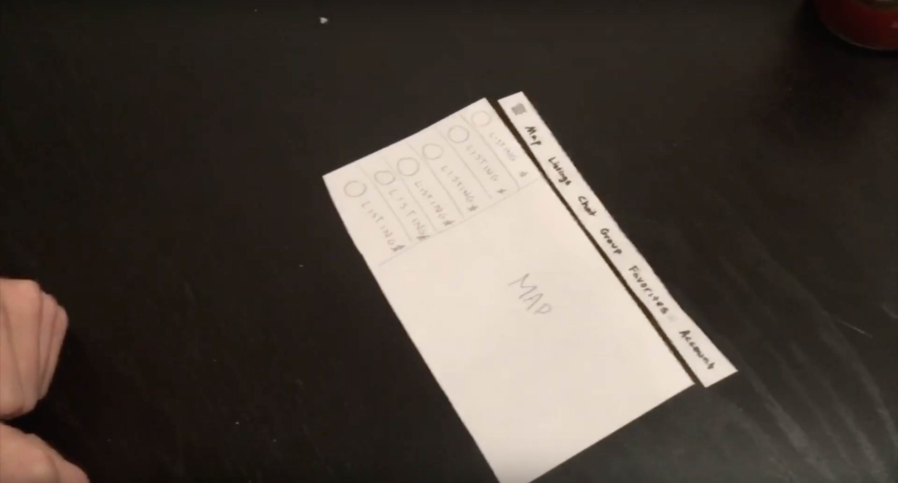

# Final Report

## Problem and Related Work

Because of the high prices of living on-campus, many students elect to live off-campus when they are allowed to. Currently, there is no centralized location for students to find housing options located nearby. Rather a combination of google searches, phone calls, and house tours are required to find proper housing. If a centralized website containing listings, contact information, and housing amenities existed for Northwestern students, it would save them countless hours and make the process of finding housing much easier. Wildcatpad.com tries to address this, but lacks modern web practices which reduces its SEO ranking, and has an non-intuitive design unlikely to attract students. Solving this issue could be very beneficial to the Northwestern community. 

## User Research

Our target users are university undergraduate or graduate students between the ages of 18 and 25. These target users come from a diverse set of backgrounds. All of them share the trait that they are currently looking for housing, or have in the past looked for housing and now live off-campus. The goal of the research was to find out what the users liked and didn’t like about the housing search process in order to decide which features we want our design to have. 

The approach we decided on was to conduct interviews that allowed us to gain insight on what types of features would be necessary. Examples of certain questions asked are what parts of the process did you not enjoy, what parts were hard to navigate, and what resources do you wish you had to improve the process. 

The user needs were clearly reflected by the contextual inquiry and interview notes. The users wanted to form groups and communicate with each other through the app. Additionally, users wanted to list areas and landmarks they wanted to live near, as well as identify different price ranges. There were many other user needs, but the primary ones we  identified were area sorting and price ranges. 

We came up with three personas we envisioned using our app:

* Johnny’s needs include being near a gym to exercise and being near a field to practice ultimate frisbee in his free time. He would like to live in an apartment that doesn’t have strict quiet hours so he can practice guitar when he gets back from class at night. Additionally, he would like to be near Mudd Library so he can continue reserving study rooms to work.

* Eddy would like to live close to South campus so he can be near his friends who aspire to live there as well. Most of his classes are south, and living near classes would make it easier to get to and from school each day. While his classes are south, he enjoys playing IM sports which mostly take place in SPAC, which is located on North campus.  Additionally, he likes to study in Main, which is slightly closer to south campus than it is to north campus

* Sarah would love to live with her sorority sisters once they become upperclassmen. Because of this, she would appreciate the ability to search for housing in groups with her best friends. She would prefer to live on South campus because she frequently goes to and from her sorority house. She would like to live with a group of 8

## Paper Prototyping

[Full Testing Video](https://www.youtube.com/watch?v=Ln6ntWCNUwg)

The users found it clear that you need to sign up/register when first coming to the website. It was intuitive for the users to see the listings and map, to add people to groups and view existing groups, and to start a chat/see existing chat. Adding to favorites was not obvious to the users. When clicking on a direct user, they didn’t find it clear what it meant to ‘add to favorites’. Furthermore, they thought that sorting the listings was pretty hard to find from the settings tab. It took users a few looks and thoughts to figure out how to sort the listings by specific metrics.

We started looking for a better way to prompt user action to add listing to favorites. An idea we had was to add more attention to the ‘add to favorites’ button via styles or add a description when hovering over the button. We also looked to add more explicit signs on the page for sorting the web page. Instead of having to click on the settings icon, we added a sort by label on the top of the page so it is more clear. This would also let users be more inclined to sort by the specific options, such as price range, price, and/or part of campus.

## High Fidelity Prototyping

For our **first** prototype, the task scenario we implemented was the ability for Eddy (one of our personas) to add a listing. The data for the listings must come from the community, and we needed people to add listings for that to happen. This meant having a feature that was a data collection form:

The components we implemented for our first prototype were the home page and the top menu bar. The homepage had a large Google map on the right hand side of the page with marked locations of where the available listings are located. To the left of that was a vertical box list of the listings. It included information such as the type of property, name of property, address, short description, and content link. On the left-most side of the page was the “Add a Listing” component from our task, which allowed the user to enter the relevant information of a new listing. Once again, it was organized vertically as each new entry was set on a new line, apart from the Zip code, which, according to established entry conventions, was to the right of the location entry box. 

For our **second** prototype, the task scenario we chose to implement was that of filtering housing listings to view them based on price, housing type (apartment, house), or by address. By this, we mean that if there are multiple listings for the same house or apartment, the page would group those together. This might happen in the case that there are multiple units of one house or apartment complex. Below is a screenshot of the filters we have mentioned. 

The components we implemented for our second prototype were two filter menus and an updated header menu bar. We were also in the process of developing a way to drop a “pin” marker on the map automatically for each listing a user adds.

For our **third** prototype, the task scenario we chose to implement was that of editing and pf expanding the listing filters to be able to sort by increasing or decreasing price, and by type (house, apartment, sublet):

Additionally, we included a filter through which users could filter by housing location relative to campus (e.g. North campus, South campus). We also added messaging functionality and a profile page for users. The purpose of the messaging functionality was to communicate with landlords in an efficient and simple manner. The components we implemented for our third prototype were edited and updated versions of the two filter menus, a new campus location menu, and the full body of the messages page (social interactions component). Additionally, we implemented the profile page, which is a user profiles component which displays information about a user. 

## Reflection

In the limited amount of time we had, we’ve managed to create a website that allows users to accomplish multiple tasks related to finding and posting housing listings in Evanston. We’ve managed to create this site through careful planning, user testing, and from improving our original idea based on received feedback. On our home page users can view housing options, and filter through them by campus location (North, Mid, South Campus), type of housing (houses, apartments, sublets), and price. Once a user clicks on a listing a pop up card opens and the user sees a more detailed description of the location. There he has the option to add the listing to his favourites or directly message the landlord. On our +Add Listing page users can add a listing by entering its name, price, category, address, and contact information. Users also have the option to create their own account. On top, in messages, users also have the option to communicate with multiple landlords simultaneously from one location. 

If we had more time we would work on integrating more of the features we have thought of during our planning phase. For example, even though we have the option to add a listing to favorites, we haven’t actually created a page that keeps track of those favorites - and as such if we had more time we would have created that page. Another feature we have thought of during the planning phases that we have not implemented, but would given more time, is the possibility for users of creating their own groups. These groups would enable all group members to view their groups favourites, and the option to communicate with the landlord via our messaging app on behalf of the whole group. 

## Links    

* [Team Repository](https://github.com/cs330-Housing-Project/housing/tree/project_8)
* [Prototype](https://cs330-housing-project.github.io/housing/)

## Instructions for use:

* Best Viewed In Chrome
* Try to find a house you might want from those available! If I gave too many instructions there would be no point in building an intuitive website.....

